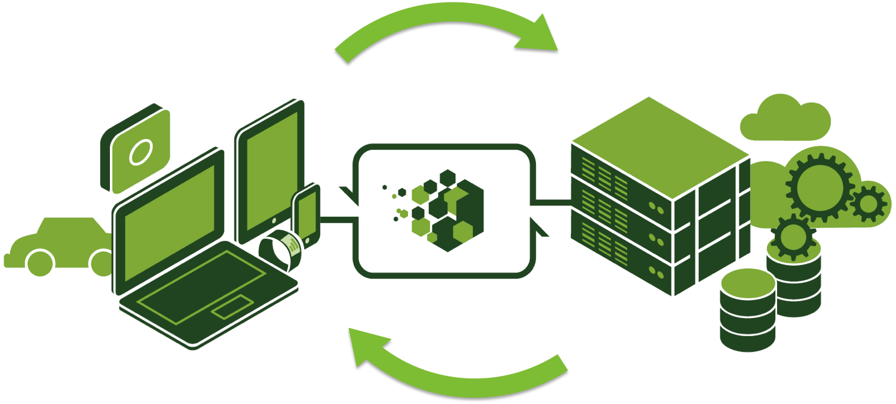

<span style="font-size: 97.5%; font-weight: lighter; transform: translateY(80%); display: block">язык программирования</span>

# JavaScript

---

## План на 4 лекции

1. Настройка окружения: VS Code, Node.js, git.
1. Базовые понятия: синтаксис, типы данных.
1. Особенности языка: функции, библиотека.
1. Много живого кодинга.

---

## Сегодня

1. История JavaScript
1. В чём запускать код?
1. Как выбрать текстовый редактор?
1. Зачем нужна система контроля версий?
1. Что нужно знать, чтобы сдать домашку?
1. Демо.

---

##  Краткая история JavaScript

- 1995 – Первая реализация
- 
- 
- 
- 

---

<!-- .slide: data-type="showcase" -->


---

##  Краткая история JavaScript

- 1995 – Первая реализация
- 1998 – Ajax
- 
- 
- 

---

<!-- .slide: data-type="showcase" -->


---

## AJAX

Позволяет обновить часть страницы, не&nbsp;перезагружая её целиком.

---

## Краткая история JavaScript

- 1995 – Первая реализация
- 1998 – Ajax
- 2006 – jQuery
- 
- 

---

JavaScript

```js
document
  .getElementsByTagName('header')[0]
```

jQuery

```js
$('header')
```

---

## Краткая история JavaScript

- 1995 – JavaScript
- 1998 – Ajax
- 2006 – jQuery
- 2009 – Node.js
- 

---

<!-- .slide: data-type="showcase" -->



---

## Краткая история JavaScript

- 1995 – JavaScript
- 1998 – Ajax
- 2006 – jQuery
- 2009 – Node.js
- 2014 – Babel.js

---

Разработчик пишет на современном языке

```js
let sum = (a, b = 0) => a + b;
```

В браузере выполянется совместимый код

```js
var sum = function sum(a) {
  return a + (
    arguments.length > 1 && 
    arguments[1] !== undefined
  ) ? arguments[1] : 0; };
```

---

## Что нас ждёт дальше?

- Progressive Web Apps
- 

---

<!-- .slide: data-type="showcase" -->


---

## Что нас ждёт дальше?

- Progressive Web Apps
- WebAssembly

---

## WebAssembly Demo

[Epic Zen Garden](https://s3.amazonaws.com/mozilla-games/ZenGarden/EpicZenGarden.html) (Firefox)

---

## Запуск кода

```js
console.log('Hello world');
```

---

## Консоль браузера

- Windows: <kbd>Ctrl</kbd> + <kbd>Shift</kbd> + <kbd>J</kbd>
- MacOS: <kbd>⌘</kbd> + <kbd>⌥</kbd> + <kbd>J</kbd>


[Using the Console](https://developers.google.com/web/tools/chrome-devtools/console/)

---

## Браузеры для разработчика

- [Chrome Canary](https://www.google.com/chrome/browser/canary.html)
- [Firefox Quantum](https://www.mozilla.org/ru/firefox/channel/desktop/#nightly)


---

## Node.js

[nodejs.org](https://nodejs.org/en/)

```bash
> node --version
v8.6.0
```

--

## Node REPL

В терминале набрать `node` и&nbsp;нажать&nbsp;<kbd>Enter</kbd>

```js
> let sum = 1 + 1
undefined
> sum
2
```

Выход – <kbd>Ctrl</kbd> + <kbd>D</kbd>

---

## Текстовый редактор

В нём вы проводите большую часть времени. Поэтому отнеситесь к выбору ответственно.

---

## Как выбрать

- поддержка используемых технологий
- скорость и производительность
- функциональность
- популярность
- цена

---

## Варианты

- [Sublime Text](https://www.sublimetext.com/)
- [WebStorm / IDEA](https://www.jetbrains.com/webstorm/)
- [Visual Studio Code](https://code.visualstudio.com/)
- [Atom](https://atom.io/)
- [Brackets](http://brackets.io/)

---

## Visual Studio Code

Рекомендованный редактор для&nbsp;прохождения&nbsp;курса.

- мощная поддержка языка
- инструменты для работы с git
- встроенный терминал

---

## Демо

Пишем чат-бота. Как в Телеграме, только для терминала. И очень простенького.

```bash
> node bot.js hello world
hello world
```

---

## git

– система контроля версий.

В целом, нужна для двух вещей: версионирования кода и совместной разработки.

[git-scm.org](https://git-scm.com/)

---

## GitHub

– графический интерфейс для git.

Есть и другая версия: это социальная сеть для&nbsp;программистов.

[github.com](https://github.com/)

---

## Ссылки про git/GitHub

- [Введение. Основы языка. GitHub](https://urfu-2016.github.io/javascript-slides/01-intro/#/37) <br><small>Язык программирования Javascript 2016</small>
- [git](https://gebetix.github.io/git/)<br><small>Разработка веб-приложений 2016</small>
- Github ([слайды](http://urfu-2015.github.io/webdev-slides/1-1-teamwork-git-github/#/), [видео](https://www.youtube.com/watch?v=mvVsrB46zkc)) <br><small>Разработка веб-приложений 2015</small>

---

## Демо

Отправляем пулл-реквест с домашкой.

[Задача «Сложить два числа»](https://github.com/urfu-2017/demo-task-1)

--

## Перед началом работы

клонируем репозиторий<br>и устанавливаем зависимости.

```bash
git clone https://github.com/urfu-...

cd demo-task-1

npm install
```

--

## Перед отправкой домашки

запускаем линтер и тесты.

```
npm run lint

npm run test
```

--

## После прохождения проверок

создаём коммит в VS Code<br>и отправляем его на гитхаб.

```bash
git push
```

---

##  Материалы к курсу

- [MDN Web Docs](https://developer.mozilla.org/ru/)
- [Speaking JavaScript](http://speakingjs.com/es5/index.html)
- [Exploring ES6](http://exploringjs.com/es6/)


---

## Материалы к домашке

- [JavaScript - Volume 1: The Early Years](https://www.youtube.com/watch?v=JxAXlJEmNMg)<br><small>Youtube</small>
- [Useful string methods](https://developer.mozilla.org/en-US/docs/Learn/JavaScript/First_steps/Useful_string_methods)<br><small>MDN</small>
- [An Overview of the Syntax](http://speakingjs.com/es5/ch07.html#_an_overview_of_the_syntax_2)
- [Control Flow Statements and Blocks](http://speakingjs.com/es5/ch07.html#_control_flow_statements_and_blocks)

---

# Конец
